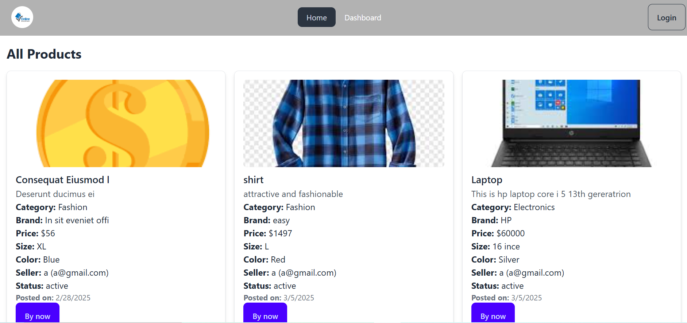
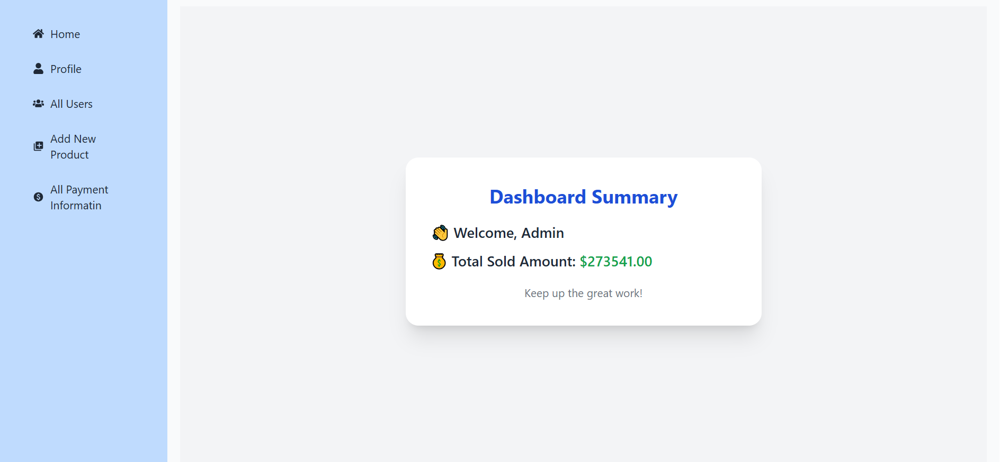

# 🛍 Online Shopping Application

A full-stack Online Shopping Web Application built using React (Frontend) and Node.js + Express + MongoDB (Backend). It supports product management, user registration/login, admin panel, secure payment via Stripe and SSLCommerz, and interactive UI animations using **Lottie.

---

👉 [Client Live Site](https://online-shoping-software-lab.web.app/)  
👉 [Backend Server Live Site](https://online-shoppin-server.vercel.app/)

---

## 📦 Tech Stack

### Frontend
- React.js
- React Router DOM – Client-side routing
- Firebase Authentication – User login and registration
- Lottie-react – Animated illustrations
- Tailwind CSS – Responsive styling
- Axios – HTTP requests
- React Toastify – Notifications

### Backend
- Node.js + Express.js – REST API
- MongoDB + Mongoose – NoSQL database & ODM
- Stripe API – International card payments
- SSLCommerz – Local (BDT) payments

- dotenv – Environment variable config
- cors – Cross-origin resource sharing

---

## 🔐 Authentication

- Firebase-based email/password authentication

- Role-based access: Admin and User

> 🔑 Admin Credentials:  
> Email: admin@gmail.com  
> Password: 1234aA

---

## 👥 User Roles

### 👤 Regular User
- Register/Login
- View and filter products
- Add products to cart
- Make payments (Stripe / SSLCommerz)

### 🛡 Admin
- View all payments
- Add new products
- Manage users (CRUD)

---

## 💰 Payment Integration

### ✅ Stripe (Card Payment)
- Accepts international card payments
- Creates payment intent on the server
- Saves payment details securely in the database

### ✅ SSLCommerz (BDT Payment)
- For local payments in Bangladesh (BDT)
- Transaction status handled with redirect URLs and webhooks
- Auto-deletes failed/incomplete transactions

---

## 🛍 Features

### Frontend
- Responsive layout with Tailwind CSS
- Lottie animations for better UX
- Product cards with filter and detail view
- Stripe and SSLCommerz checkout options
- Role-based dashboard for Admin and User

### Backend
- RESTful API using Express
- Product, User, and Payment collections
- JWT-based protected routes
- District & Upazila API for location filtering
- Admin-only access for critical routes

---

## ⚙ Installation & Setup

### 1. Clone the Repository

bash
git clone https://github.com/alamin20cse/Online-Shopping

---

### 2. Backend Setup

bash
cd server
npm install

Create a .env file in server/:

env
PORT=5000
MONGODB_URI=your_mongodb_uri
JWT_SECRET=your_jwt_secret
STRIPE_SECRET=your_stripe_key
SSL_STORE_ID=your_sslcommerz_store_id
SSL_STORE_PASS=your_sslcommerz_store_password

Start the backend server:

bash
node index.js

---

### 3. Frontend Setup

bash
cd client
npm install
npm run dev

Create a .env file in client/:

env
VITE_apiKey=your_firebase_api_key
VITE_authDomain=your_firebase_auth_domain
VITE_projectId=your_project_id
VITE_storageBucket=your_storage_bucket
VITE_messagingSenderId=your_messagingSenderId
VITE_appId=your_app_id

# Cloudinary
VITE_CLOUDINARY_CLOUD_NAME=your_cloud_name
VITE_CLOUDINARY_API_KEY=your_api_key
VITE_APP_CLOUDINARY_API_SECRET=your_api_secret
VITE_CLOUDINARY_UPLOAD_PRESET=your_upload_preset

---

### 🔥 Firebase Config (Frontend Example)

js
// Import the functions you need from the SDKs
import { initializeApp } from "firebase/app";
import { getAuth } from "firebase/auth";

// Your Firebase configuration
const firebaseConfig = {
  apiKey: import.meta.env.VITE_apiKey,
  authDomain: import.meta.env.VITE_authDomain,
  projectId: import.meta.env.VITE_projectId,
  storageBucket: import.meta.env.VITE_storageBucket,
  messagingSenderId: import.meta.env.VITE_messagingSenderId,
  appId: import.meta.env.VITE_appId,
};

// Initialize Firebase
const app = initializeApp(firebaseConfig);
export const auth = getAuth(app);

---

## 📸 Screenshots

### Login page

### All payment information

### Payment page

## ✅ Testing

- As a User: Register/Login, browse products, add to cart, checkout via Stripe or SSLCommerz
- As Admin: Login with admin credentials, manage users/products, view all transactions

---

## 🤝 Contributors

1. [Md. Al-Amin Hossain](https://alamin20cse.surge.sh)  
2. [Afreen Jahan](https://afrin20cse008.surge.sh/)  
3. [Bondhon Das](https://strangerbond.github.io/Bondhon-Portfolio/)

---
